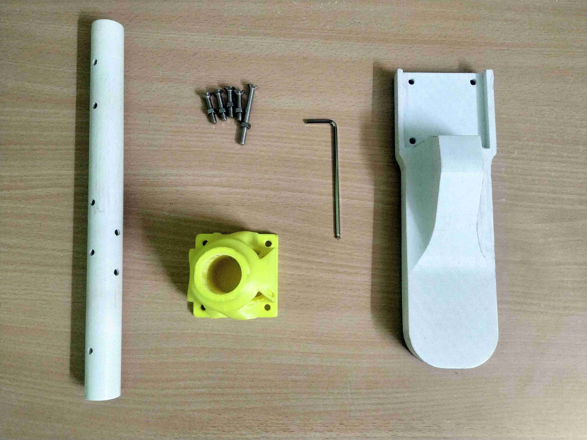
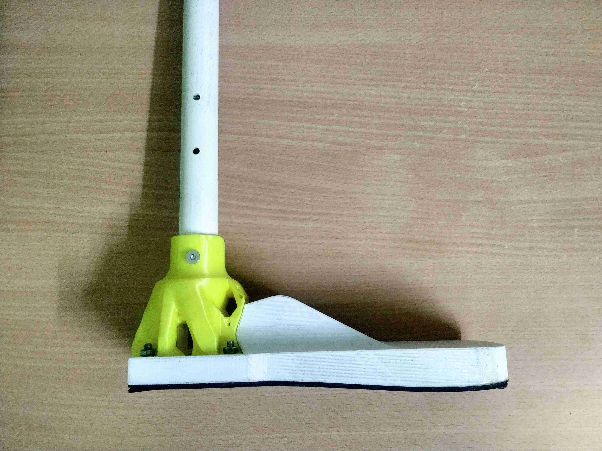

A prosthetic ankle can either be a passive SACH *(Solid Ankle Cushioned Heel)* feet or an active ESAR *(Energy Storage and Return)* feet. A ESAR feet is capable of storing energy during the stance phase and releasing it during push-off. Though ESAR feet can better mimic the functions of an actual ankle, a SACH feet is lighter, durable, more stable and is quite inexpensive.

# Components
\\

| 3D printed components | 2 | 376g PLA/ABS |
| 300mm PVC pipe (Diameter: 1in) | 1 | $3 |
| [50mm M5 SS Nuts & Bolts](https://www.amazon.com/s?k=m5+50mm+bolt&ref=nb_sb_noss_2) | 1 | $1 |
| [25mm M5 SS Nuts & Bolts](https://www.amazon.com/s?k=m5+50mm+bolt&ref=nb_sb_noss_2) | 4 | $2 |
| | **Total** | $6 |

*The links provided are for reference purposes only.

# 3D Printing

\\
The settings used for each of the two 3D printed components are listed below,

| *Parameter* | Component 4 | Component 5 |
| Nozzle diameter | 0.4mm | 0.4mm |
| Layer height | 0.2mm | 0.2mm |
| Infill | 60% | 50% |
| Mass | 109g| 267g |
| Duration | 14hrs 0mins | 20hrs 36mins |

STL files can be found under the [repository](https://github.com/homebrew-bionics/Mark-I).
# Assembly

\\
