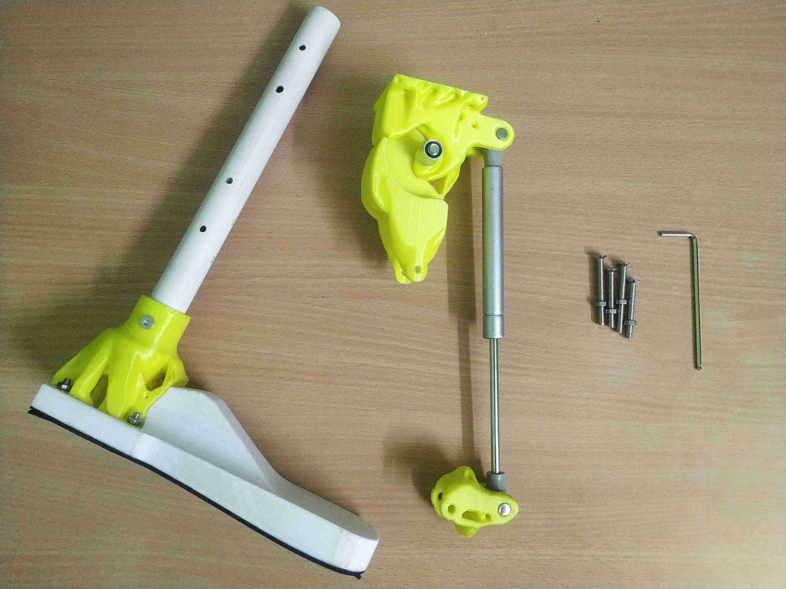
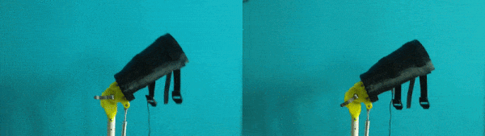

The showcased design is a **work in progress** and efforts are being made to improve overall functionality and stability of the prosthetic leg.

# Components
\\
The developed lower-limb prosthetic leg costs **$34** and **611g of PLA/ABS** filament for 3D printing. ``1000g`` of PLA/ABS filament costs around **$20** which roughly brings the total cost close to **$55**.

| Knee assembly | 3D printed components | 3 | 235g PLA/ABS |
| | Other components | 4 | $28 |
| Ankle assembly | 3D printed components | 2 | 376g PLA/ABS |
| | Other components | 3 | $6 |
| | | **Total** | $34 |

Hydraulic gas springs are available at a range of pressure values. Inexpensive hydraulic gas springs lack the functionality to be able to adjust the valves to tune the swing flexion and extension. If this functionality is much desired, [Rear shocks](https://www.amazon.com/s?k=mountain+bike+rear+shock&ref=nb_sb_noss_2){:target="_blank"} found on mountain bikes can be used instead of inexpensive hydraulic gas springs. Both rebound and compression can be adjusted. Tuning the pressure difference between main air chamber and negative air chamber requires precision.

*The showcased design is not meant to be used with a [rear shock](https://www.amazon.com/s?k=mountain+bike+rear+shock&ref=nb_sb_noss_2){:target="_blank"}.
# Friction control
\\
{:width="900px"}

In addition to tuning the hydraulic cylinder as per the amputee's weight and walking speed, the quick-release clamp can be adjusted to increase or decrease the friction between components one and two, this significantly modifies the knee joint's dynamic behaviour.

