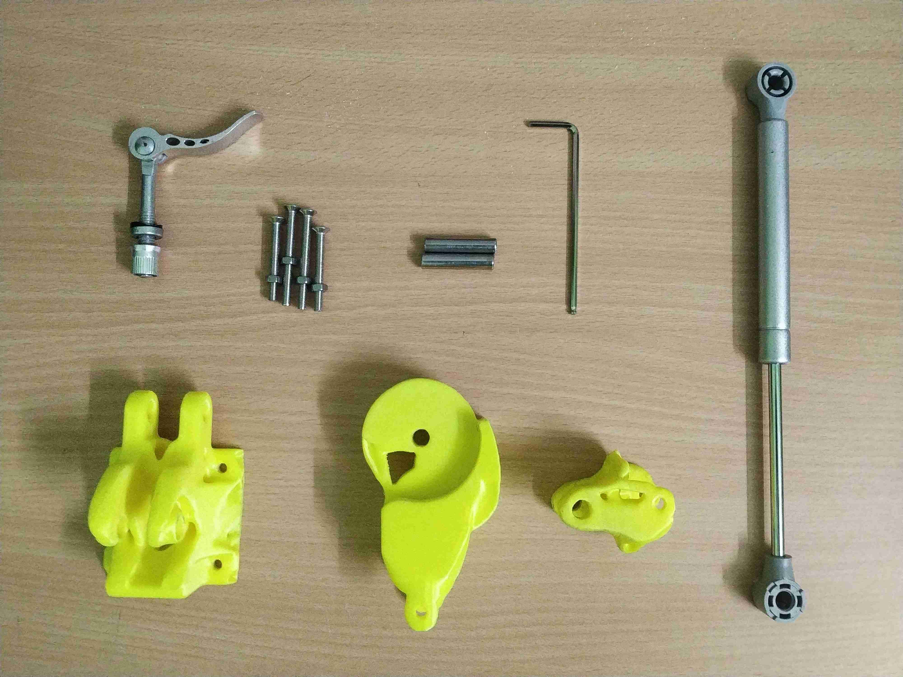

Prosthetic knees range from simple, purely mechanical devices to sophisticated microprocessor-controlled systems. A Hydraulic prosthetic knee consists of a hydraulic cylinder in a single axis or polycentric knee design. Valves of the hydraulic cylinder can be adjusted to tune the swing flexion and extension as per the amputee's desired walking speed.

# Components
\\

| 3D printed components | 3 | 235g PLA/ABS |
| [Hydraulic gas spring](https://www.amazon.com/s?k=hydraulic+gas+spring&ref=nb_sb_noss_1){:target="_blank"} | 1 | $15 |
| [Quick release clamp](https://www.amazon.com/s?k=quick+release+clamp+bolt&ref=nb_sb_noss_2){:target="_blank"} | 1 | $7 |
| [50mm M5 SS Nuts & Bolts](https://www.amazon.com/s?k=m5+50mm+bolt&ref=nb_sb_noss_2){:target="_blank"} | 4 | $3 |
| [50mm M8 SS Nuts & Bolts or 8mm SS Shaft](https://www.amazon.com/s?k=m8+bolt&ref=nb_sb_noss_2){:target="_blank"} | 2 | $3 |
| | **Total** | $28 |

*The links provided are for reference purposes only.

# 3D Printing

\\
The settings used for each of the three 3D printed components are listed below,

| *Parameter* | Component 1 | Component 2 | Component 3 |
| Nozzle diameter | 0.4mm | 0.4mm | 0.4mm |
| Layer height | 0.2mm | 0.2mm | 0.2mm |
| Infill | 80% | 80% | 80% |
| Mass | 94g| 109g | 32g |
| Duration | 11hrs 18mins | 13hrs 7mins | 4hrs 57mins  |

STL files can be found under the [repository](https://github.com/homebrew-bionics/Mark-I){:target="_blank"}. Each 3D printed component has been optimized for minimal compliance under a specified volume fraction.

# Assembly

\\
The entire assembly process can be broken down into three steps,
* Assemble components one and two concentrically, ensure that there is no friction between the 3D printed components.
* Lock these two components in-place with the quick-release clamp to make a sub-assembly.
* Use two M8 bolts or 8mm SS shafts to mount the hydraulic gas spring such that it connects the sub-assembly to component three.

\\
