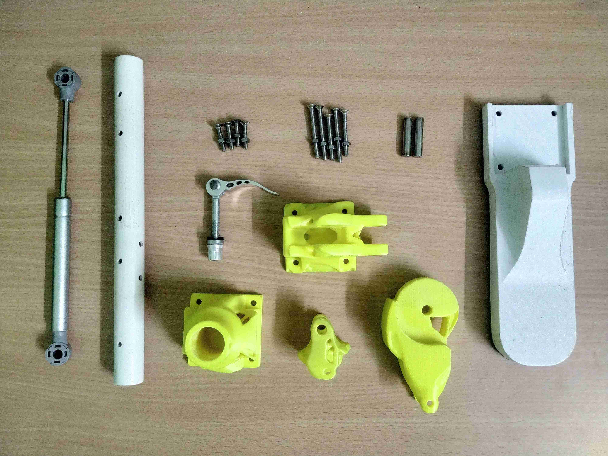

The developed lower-limb prosthesis comprises a socket, a knee assembly, and an ankle assembly. The prosthetic leg is made mostly from 3D printed parts that are optimized to withstand the specified load. The design criteria were to minimize printing time and cost of filament and to maximize each component's stiffness. In addition,

* Ease of repair
* Ease of assembly
* Modularity
* Overall cost
* Availability of off-the-shelf components

were also a concern. [Anton](https://anton.readthedocs.io/en/latest/){:target="_blank"}: an open-source generative design framework was used to minimize the compliance of each component under a specified volume fraction thereby minimizing the amount of material (filament) used.

All the required components can be rapidly manufactured with a FDM 3D printer that has the following specifications,

* Filament: ``ABS`` *(``PLA`` for Testing)*
* Minimum of ``200mm*200mm*200mm`` printing volume.
* Minimum nozzle diameter of ``0.4mm``
* Minimum layer resolution of ``0.2mm``
* Minimum precision of ``+-0.1mm``

All the required files for 3D printing can be found under the respective repository. To report a problem on any of the components, create an [issue](https://guides.github.com/features/issues/){:target="_blank"} clearly stating the problem, the settings used, and the specification of your 3D printer. 

To suggest changes/improvements, create a [pull-request](https://docs.github.com/en/free-pro-team@latest/github/collaborating-with-issues-and-pull-requests/creating-a-pull-request){:target="_blank"} with the modified files. The changes will then be validated by one of us and upon successful validation, the suggested changes will be added to the repository.
