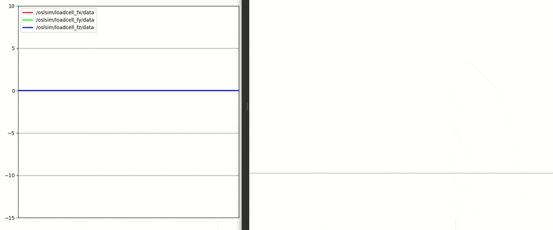
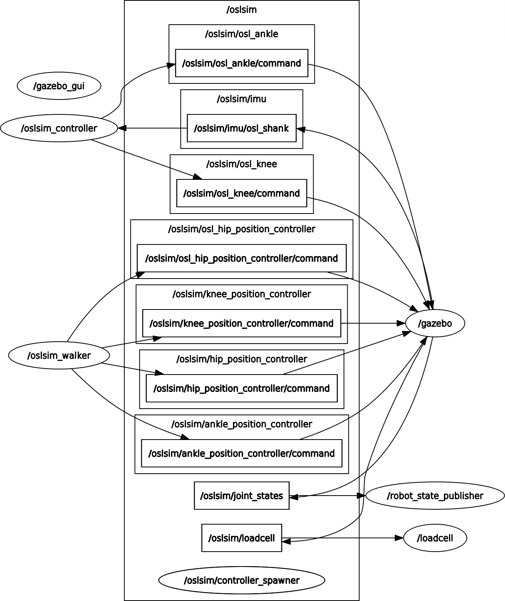

[](https://opensourceleg.com/)
[](http://wiki.ros.org/melodic)
[](https://github.com/homebrew-bionics/oslsim/blob/master/LICENSE.md)


A ROS package that provides the necessary interfaces to simulate the Open-source leg (OSL) proposed by the **Neurobionics Lab at the University of Michigan** to unify the research field of prosthetic leg controls. OSL is a robust and relatively inexpensive system that can be easily manufactured, assembled, and controlled. OSL is licensed under a [Creative Commons Attribution 3.0 Unported License](https://creativecommons.org/licenses/by/3.0/deed.en_US){:target="_blank"}. To know more, visit [opensourceleg.com](https://opensourceleg.com){:target="_blank"}

## Getting Started


This package requires an installation of [ROS](https://www.ros.org/){:target="_blank"} and [Gazebo](http://gazebosim.org/){:target="_blank"}.
```
$ sudo apt-get install ros-<ros-distro>-desktop-full
$ sudo apt-get install ros-<ros-distro>-ros-control
$ sudo apt-get install ros-melodic-effort-controllers
```
*Preferred **\<ros-distro\>**: ``melodic``*. If you are new to **ROS**, read more about [Configuring your ROS environment](http://wiki.ros.org/ROS/Tutorials/InstallingandConfiguringROSEnvironment){:target="_blank"}.

Build the package in your catkin workspace.
```
$ cd <catkin-workspace>/src
$ git clone https://github.com/homebrew-bionics/oslsim.git
$ cd ../
$ catkin_make
$ source devel/setup.bash
```
## Sensors
\\


The Open-source Leg (OSL) model in this package comprises

* 6 Inertial Measurement units
* Odometry
* 2 Load cells

## Topics
\\


## Load cells
\\
Each foot has a bumper plugin that acts as a load cell. The plugin publishes
* Force (fx, fy, fz)
* Torque (Tx, Ty, Tz)
* Contact positions
* Contact normals



A python script is included within this package that subscribes to the above sensor data and publishes the required ones to any desired ROS topic.

## Run

<p align="center">
    
</p>

To launch the simulation:

```
$ roslaunch oslsim main.launch walk:=true
```


The ``oslsim_walker`` node serves as a container to various control strategies and publishes joint commands to their respective position controllers. 