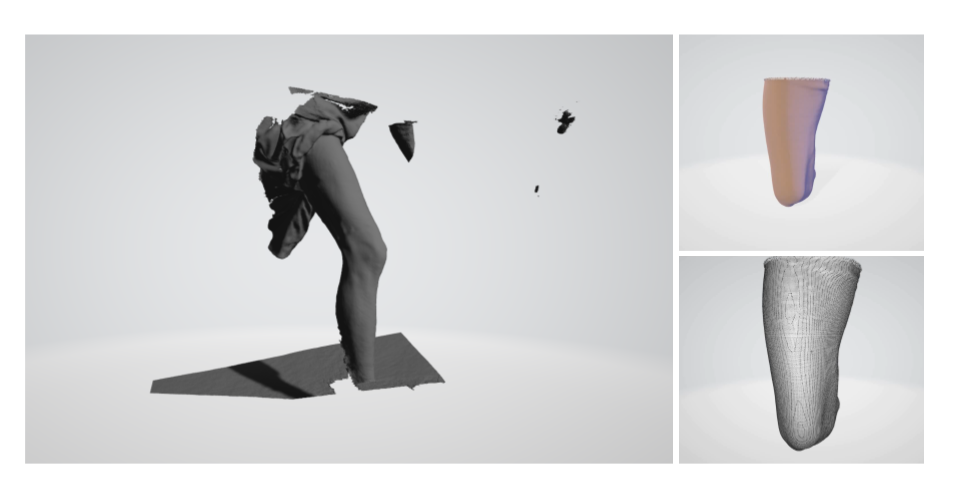
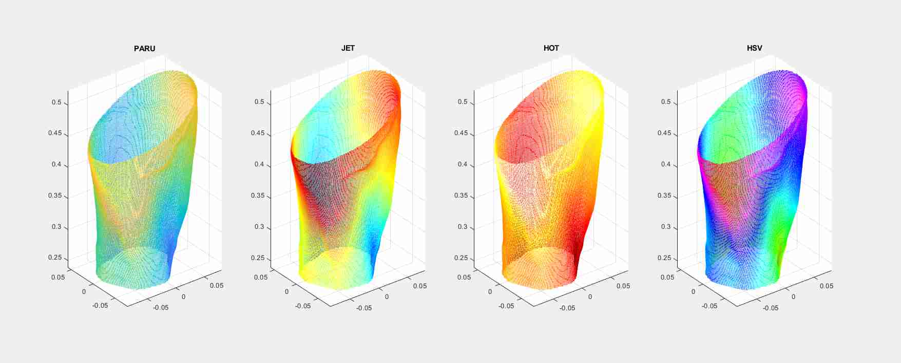
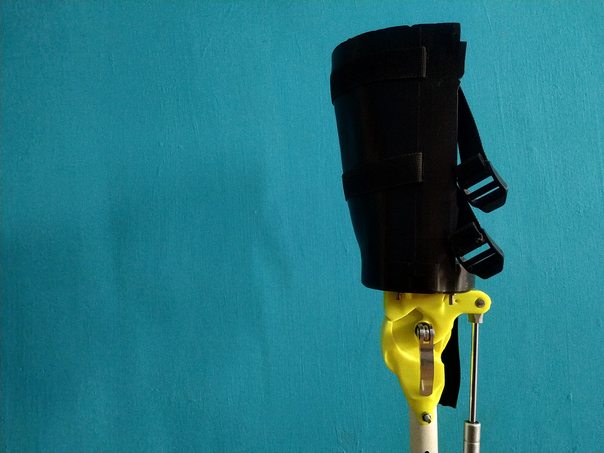

Many amputees still reject their prescribed prosthetic leg due to a sub-optimal interaction between the socket and the residual limb tissues. Factors like stress, volume fluctuation, and temperature affect the stump-socket interface and reduce the comfort/stability of the prosthetic leg. The socket represents a critical interface between the amputee and the prosthetic device. A socket has to ensure efficient fitting, appropriate load transmission, stability, and control. 

The traditional socket manufacturing process is a labor-intensive process. A prosthetist evaluates the topology of an amputee’s residual limb, takes reference measurements of the stump, and obtains a negative mold of the residual limb. This negative mold is then removed after hardening, and a positive mold is made by filling the cast, and additional modifications are made if required. Lack of skilled personnel can significantly affect the quality of fit, leading to instability and pistoning effect.

# Residual Limb Scanner

\\
A non-contact/remote methodology using 3D reconstruction techniques can eliminate a chunk of manpower, time, and inconsistency involved in the traditional socket manufacturing process. Depth sensors like Kinect, leap, etc can be used to reconstruct the residual limb.

A WPF application for scanning the residual limb of an amputee with Kinect sensor. More details on how to install the application and its usage can be found [here](https://github.com/homebrew-bionics/Residual-Limb-Scanner){:target="_blank"}.

The application exports the reconstructed model as a point-cloud file, euclidean distance of each sampled point from the central axis of the residual limb can be used to assess the stiffness of each point and to ensure that the reconstructed model accurately represents the residual limb.

The exported results can then be cleaned and converted to a 3D printable STL file with [Blender](https://www.blender.org/) or any preferred application.

# Settings

\\
The settings used to print a socket on 1:1 scale for load testing the prosthetic leg, can be found below. A sample STL file can be downloaded from the [repository](https://github.com/homebrew-bionics/Residual-Limb-Scanner).

| Parameter | Value |
| ----------- | ----------- |
| Nozzle diameter | 0.4mm |
| Layer height | 0.2mm |
| Infill pattern | Cubic |
| Infill percentage | 40% |
| Filament | PLA (277g) |
| Duration | 23hrs 14mins |

